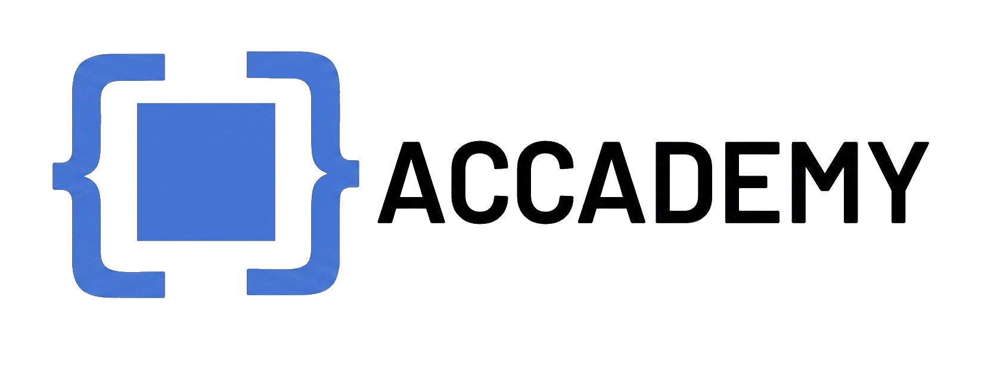

  

  
  

  <h2>The most complete platform for mastering cloud and DevOps workflows</h2>
  blueaccademy is an open source learning platform for Kubernetes, Docker, Pulumi, 
  GitHub Actions, and adjacent infrastructure workflows.  
  It gives you everything you need to build real operational skill through
  flashcards, guided terminal drills, CKAD-style validation, 
  and broader real-environment exercises.

   
  
  
  
  
  

   
  <a href="#run-it-locally"><strong>Run it now locally</strong></a>

  

## Status
### Current
blueaccademy started as a fast TypeScript prototype to validate the product direction. Currently, the backend is being
rewritten in Python/FastAPI to make the architecture more maintainable, while the frontend still
reflects prototype-era structure.

Right now, **the flashcards section is only the part that is stable and usable**. After the initial automatic seed,
you can add custom cards and import existing Anki decks.

### Supported now
The current supported slice is:

- deck create/edit/delete
- full flashcard study and review flow
- custom card creation with persistent storage via UI
- persistence through the Python backend
- repo-managed seed initial data present in `backend/app/db/learning_content/`

### In progress
The following areas are currently being migrated to the new Python structure:
- guided terminal exercises

### Not yet supported
The following areas are not yet supported in this release, and PRs will not be accepted for the following areas:

- CKAD-style validation flows
- broader E2E / real-environment exercises
- chat and hosted sandbox orchestration

## Run it locally

`cd infra && docker compose up --build`

Backend defaults:
- FastAPI on `http://localhost:8000`
- Vite on `http://localhost:5173`
- Postgres on `localhost:5432`
- frontend API base via `VITE_PYTHON_API_BASE_URL`

## Architecture
Right now the repo is split into:
- `frontend/` — React/Vite frontend
- `backend/app/` — FastAPI backend, schemas, services, and ORM models
- `backend/app/db/learning_content/` — repo-managed starter flashcard and deck content
- `infra/` — Dockerfiles and local Compose setup

The current runtime entrypoint is the Docker setup in `infra/`.

## Product Sections

- Flashcards: deck CRUD, spaced repetition, import
- Terminal Lab: guided drills plus free terminal execution
- CKAD Sim: kubeconfig-backed validation and cleanup
- E2E Sim: Azure/Pulumi/hybrid real-environment exercises
- Chat: SSE-based assistant flow
- Cluster/Sandbox: Hetzner-backed provisioning and session lifecycle

## Development Expectations

- Keep the frontend and backend boundary explicit
- Prefer fixing contracts over adding compatibility hacks
- Do not reintroduce TypeScript backend runtime dependencies
- Keep README lightweight for now; a fuller local-run guide can be added after refactor

## Code of Conduct

Please read the [Code of Conduct](CODE_OF_CONDUCT.md) before participating in the project or community spaces.

## License

This repository's source code is available under the [Apache License 2.0](LICENSE).
